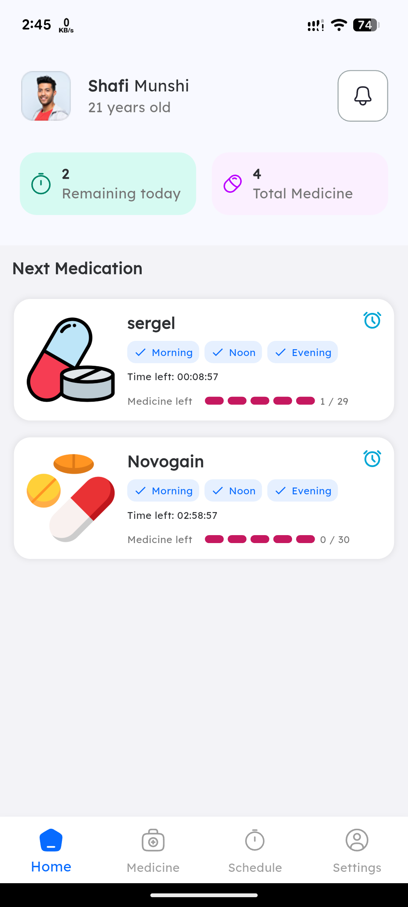
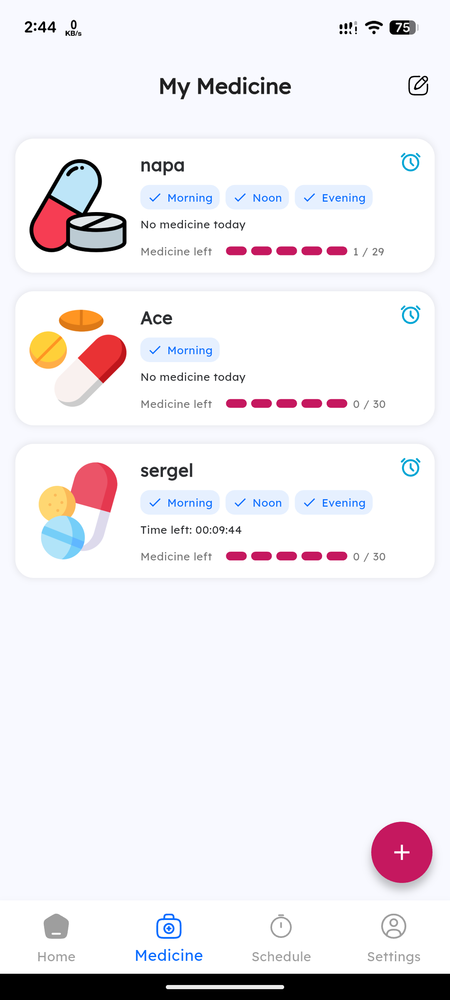
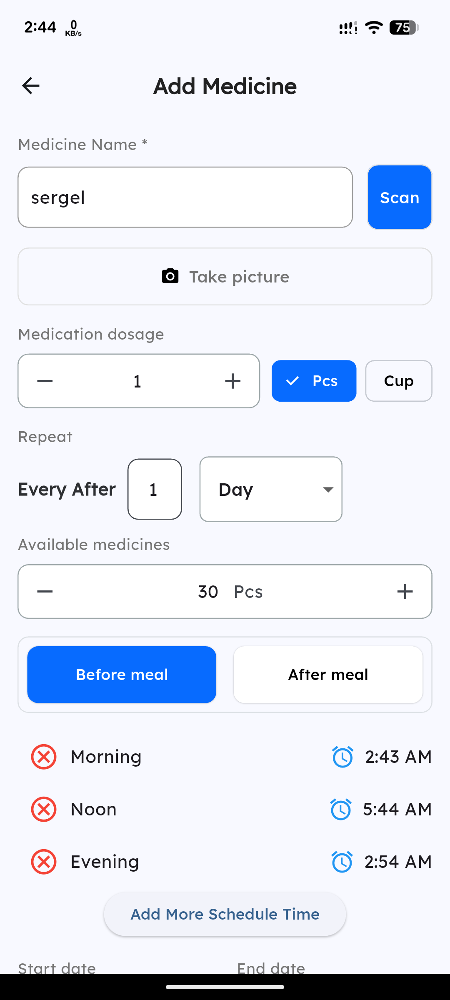
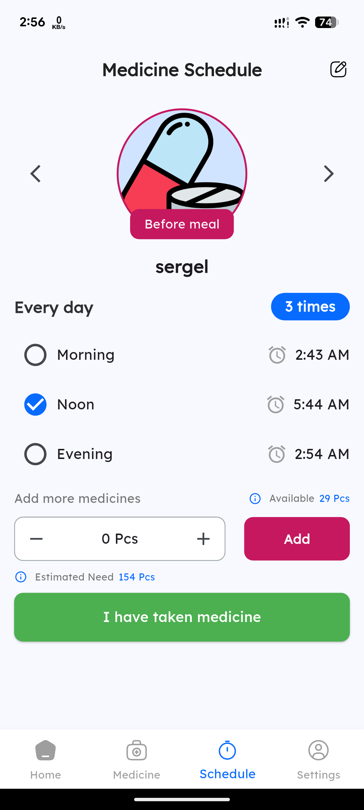
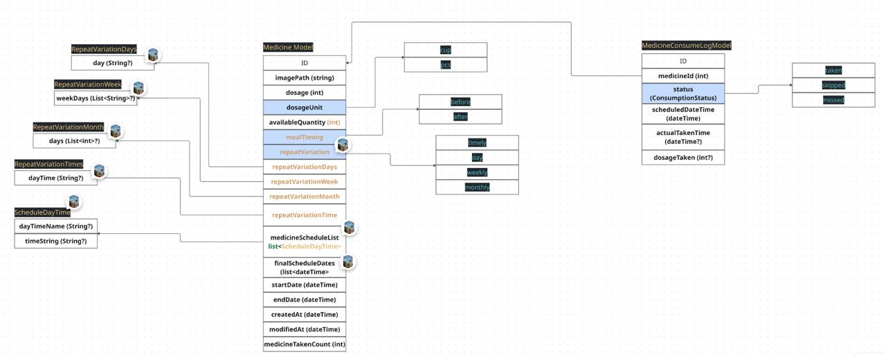

# 💊 Medicine Scheduler App

A simple and efficient **Medicine Reminder & Scheduler** built with **Flutter**.  
The application helps users manage their medicine schedules and receive reminders on time.

This project follows **MVVM Architecture** and uses **Provider** for state management.  
All medicine data is stored locally using **Isar Database**, making the app fast and fully offline.

---

## ✨ Features

- Schedule medicines easily
- Flexible scheduling options:
  - Every Day
  - Weekly
  - Specific date of the month
- Local notification reminders
- Medicine type support (tablet, syrup, capsule, etc.)
- Offline-first design
- Fast local database using Isar
- Clean MVVM architecture

---

## 🏗️ Architecture

The project follows the **MVVM (Model - View - ViewModel)** architecture to keep the codebase scalable and maintainable.
```
lib/
│
├── models/
│ └── medicine_consumption_model.dart
│ └── medicine_model.dart
│ └── medicine_time_schedule.dart
│ └── repeat_variation.dart
│ └── medicine_model.dart
│ └── user_model.dart
│
├── viewmodels/
│ └── home_view_model.dart
│ └── medicine_view_model.dart
│ └── profile_view_model.dart
│ └── schedule_view_model.dart
│ └── auth_view_model.dart
│
├── views/
│ ├── add_medicine
│ ├── auth
│ └── home
│ └── my_medicine
│ └── schedule
│ └── settings
│
├── services/
│ ├── isar_service.dart
│ └── notification_service.dart
│
└── main.dart
```

### MVVM Layer Explanation

**Model**
- Represents the data structure
- Handles serialization for Isar

**View**
- Flutter UI screens
- Displays data and handles user interactions

**ViewModel**
- Manages business logic
- Communicates between View and Model
- Uses **Provider** for reactive UI updates

---

## 📦 Tech Stack

- **Flutter**
- **Provider** (State Management)
- **Isar Database**
- **Flutter Local Notifications**

---

## 📸 Screenshots

| Home Screen | My Medicine | Add Medicine | Schedule |
|-------------|--------------|----------|----------|
|  |  |  |  |

---
## 📸 Database Schema
 

## 🚀 Getting Started
Flutter version used: 3.32.4

### 1️⃣ Clone the repository and run

```bash
git clone https://github.com/ShafiMunshi/Medicine_Scheduler.git

# open the project
cd medicine_app

# get project dependency
flutter pub get

# generate schema code for ISAR and serialization/deserialization
dart run build_runner build --delete-conflicting-outputs

# Run the project
flutter run
```

🤝 Contributions

Contributions are welcome!

If you’d like to improve the project, feel free to fork the repository and submit a pull request.

